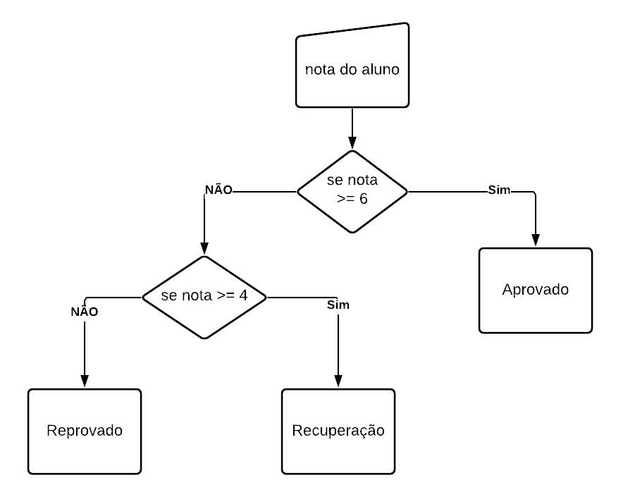
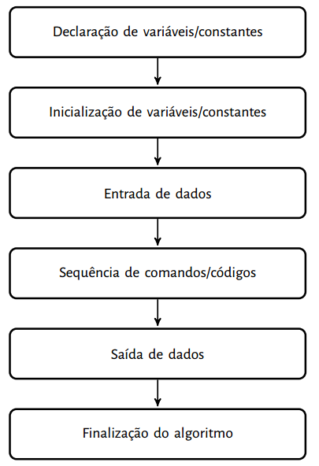

# 3.1. Introdução a Algoritmos

## O que é um Algoritmo

O primeiro passo no aprendizado de programação é entender o conceito mais fundamental de todos, o conceito de algoritmo.

Algoritmo é uma sequência lógica de instruções a serem executadas para se realizar alguma tarefa, assim, um programa é uma formalização de um ou mais algoritmos, seguindo suas regras, chamadas de semântica e sintaxe, de forma que permita que o computador entenda e execute tais instruções.

Não se preocupe com o significado de semântica e sintaxe, na próxima seção esses conceitos serão explicados.

Um simples exemplo de algoritmo seria a tarefa de trocar uma lâmpada queimada de uma sala. Poderíamos montar um algoritmo em português da seguinte forma:

```text
Pegar uma escada;
Posicionar a escada abaixo da lâmpada;
Subir na escada com a lâmpada nova em mãos;
Retirar a lâmpada queimada;
Colocar a lâmpada nova;
Descer da escada.
```

Ou

```text
Subir na escada com a lâmpada nova em mãos;
Retirar a lâmpada queimada;
Colocar a lâmpada nova;
Sair da escada.
```

Ambos algoritmos escritos em português realizam a mesma tarefa, mas porque são diferentes? A diferença entre eles é explicada por uma expressão, **nível de abstração**, o primeiro é menos abstrato que o segundo, ou seja, tem mais detalhes que o segundo. Note que para subir na escada, é preciso que ela esteja na sala e esteja abaixo da lâmpada queimada para ser trocada, contudo no segundo algoritmo isso foi omitido, não significa que esta ação não seja necessária, mas ela foi omitida para deixar o código menor, mais abstrato.


Nível de abstração é o quão detalhado um código é, quanto maior o nível de abstração, menor é o número de detalhes aparentes no código, isso não significa que detalhes não sejam cobertos pelo código, apenas são 'escondidos'.




1\) Algoritmo para Sacar dinheiro.

```text
Ir até o caixa eletrônico
Colocar o cartão
Digitar a senha ou utilizar a impressão digital
Solicitar o saque
Informar o valor do saldo
Se o saldo for maior ou igual ao valor pedido, permitir o saque.
Senão (caso contrário), informar que o saldo é insuficiente.
Se o saque foi permitido, retirar o dinheiro
Retirar o cartão
```



1\) Monte um algoritmo para fazer arroz, mostre o algoritmo a um amigo e pergunte se o passo a passo que você escreveu permite que ele faça o arroz ou se faltam informações.



1\) Veja o algoritmo abaixo para realizar o pagamento com cartão de crédito e reflita se ele está correto ou se faltam informações. 

Nota: Não tem problema o algoritmo abstrair algumas informações, preste atenção se o algoritmo está correto.

```text
Realizar as compras
Ir ao caixa do supermercado
Aguardar o caixa realizar a contagem dos produtos e preços ('passar todos produtos')
Digitar a senha do cartão de crédito
Pegar o comprovante de compra
```



1\) Monte um algoritmo para um segurança verificar se uma pessoa pode entrar em uma festa. Essa festa é para convidados maiores de 18 anos.

```text
1. Primeiro indique a entrada de dados, ou seja, a pessoa irá chegar e o segurança precisa fazer o que? perguntar nome? idade?
2. Pense nas informações que o segurança precisa verificar
3. Se a pessoa for menor de idade, o que acontece? E se for maior?
4. Se o nome da pessoa não está na lista, o que acontece? e se tiver na lista?
5. Há mais alguma informação para verificar para impedir ou permitir que a pessoa entre na festa?
```



1\) Veja o algoritmo para realizar o cálculo do valor final de um produto a partir da soma do valor do produto com o frete, produto com peso maior que 500g tem acréscimo de 5 reais e produtos com até 500g tem acréscimo de 2 reais.

Teste o algoritmo com a seguinte entrada e informe a saída.

| Entrada | Saída |
| :--- | :--- |
| peso = 300 | preço final = ??? |
| preço = 14 |  |

```text
Leia o peso do produto
Leia o preço do produto
Se o peso for maior que 500 então
preco final recebe preço + 5
Senão
preço final recebe preço + 2
Imprime o preço final
```

2\) Veja o algoritmo para testagem manual de todas lampadas compradas para um estabelecimento e execute passo a passo em sua cabeça.

Teste o algoritmo considerando que tenhamos 3 lâmpadas, sendo que a segunda está estragada. O que acontecerá a cada teste?

```text
Enquanto houver lampadas para serem testadas o testador irá:
  pegar a lampada
  coloca no aparelho que testa
  se a lâmpada acender
    marcar na lâmpada como 'ok'
  senão informar ao superior que a lâmpada está estragada    
```

3\) Veja o algoritmo para cálculo da série fibonacci para imprimir os 5 primeiros elementos da série e execute passo a passo em sua cabeça ou papel, tente obter até o quinto elemento.  Os primeiros elementos estão ilustrados abaixo.

Antes de montarmos o algoritmo você precisa entender o problema, entender a série. Perceba que começa com 1, o segundo elemento é 1, o terceiro é 2 e o quarto é 3. Qual a lógica entre eles?

Se analisar, o primeiro elemento é 1, o segundo é o primeiro elemento mais o anterior \(não existe, então consideramos 0\). O terceiro elemento \(2\) é o segundo elemento \(1\) somado com o primeiro \(1\). Ou seja, para formar os números basta somar os dois números antecessores.

$$
1, 1, 2, 3, 5, 8, 13, 21, 34, 55, 89, ...
$$

```text
Crie três espaços de memória para armazenar o anterior, atual, proximo número.
Anterior começa com 0
Atual começa com 1
Proximo começa com anterior + atual
Leia o número de elementos que a série terá
Defina um contador que começe com 0
Enquanto contador for menor que número de elementos faça
  Imprima o atual
  próximo recebe anterior + atual
  Anterior recebe o valor de Atual
  Atual recebe o valor do próximo  
```



1\) Escreva um algoritmo em português que consista no passo a passo das suas atividades ao se levantar até a hora do almoço nas terças-feiras.

2\) Faça um algoritmo que leia as notas de 4 bimestres de um aluno e calculo a sua nota final, considere a nota final como a soma das quatro notas.

3\) Monte um algoritmo que leia o peso e altura de uma pessoa e diga qual a classificação da pessoa de acordo com o seu IMC, considere a tabela abaixo.

| IMC | Classificação | Obesidade \(Grau\) |
| :--- | :--- | :--- |
| &lt; 18.5 | Magreza | 0 |
| Entre 18.5 e 24.9 | Normal | 0 |
| Entre 25 e 29.9 | Sobrepeso | I |
| Entre 30 e 39.9 | Obesidade | II |
| Maior que 40 | Obesidade Grave | III |

Fonte: https://www.programasaudefacil.com.br/calculadora-de-imc.

4\) Marque as alternativas que a resposta é sim e não marque as demais.

* [ ] João tem duas planilhas do excel. A primeira tem 1000 alunos e seus respectivos números de matrícula, nomes e CPFs. A segunda tem a renda e o ano de entrada de 500 alunos. João gostaria de juntar essas planilhas, seria possível juntar as duas para gerar uma nova com número de matrícula, nome, CPF, renda e ano de entrada de cada aluno? Como as duas planilhas não tem os mesmos alunos, nem todos terão informações completas. 
* [ ] José utiliza um programa que gera, a cada teste, uma planilha com dados de um trem. Após a geração da planilha, ele precisa realizar alguns cálculos no excel, como média da velocidade do trem etc. Contudo, José precisa realizar 20 testes, seria possível que em vez de fazer os cálculos 20 vezes, uma para cada teste, ele criasse um programa que realiza a leitura das planilhas e depois gera preenche as planilhas com todos os cálculos realizados? 
* [ ] Juca precisa pegar as 5 primeiras linhas de 50 arquivos e juntar em uma nova planilha do excel, pois precisa realizar o cálculo de média de todos os valores obtidos. Seria possível utilizar programação para criar um programa que realiza a leitura das 5 primeiras linhas de cada um dos 50 arquivos e gera uma nova planilha com todos os dados? 
* [ ] Às vezes, você diz aos seus amigos que irá a uma festa caso tenha dinheiro. Concorda que você poderia criar um programa que verifica o saldo da sua conta e responde aos seus amigos se você irá ou não à uma festa? \item A questão anterior, sobre ir à festa, indica que a lógica para ir a festa na sua vida real pode ser usada na programação para criar um programa que auxilie sua vida, até mesmo poupando seu tempo de responder seus amigos?

5\) Marque as opções verdadeiras:

* [ ] Podemos considerar que o pedido do aluno para ir ao banheiro é um algoritmo que utiliza uma mensagem enviada ao professor, a leitura dessa mensagem e a verificação desta com base em uma condição para prosseguir até o banheiro. 
* [ ] Verificar a nota de todos os alunos da turma verificando se cada uma é pelo menos 60 para saber quais alunos passaram na disciplina é um algoritmo que repete uma verificação de nota sob uma condição para cada um dos N alunos \(número, a princípio, indeterminado de alunos\). 
* [ ] Pedir a um aluno para preencher um formulário pode ser considerado um algoritmo. 
* [ ] O preenchimento do formulário por parte do aluno pode ser considerado um algoritmo. 
* [ ] A frase a seguir pode ser considerada um algoritmo? "Ande 10 passos para frente, vire 90° para a direita, ande 5 passos para frente, pare, levante o braço..."

6\) A empresa Google costuma criar modificações de sua logo inserindo notícias, animações ou pequenos jogos, em datas comemorativas. Esses elementos são conhecidos como Doodles. Um deles é de "Comemoração de 50 anos de programação para crianças" e consiste em um pequeno jogo onde o usuário deve "programar" as funções de um coelhinho usando conceitos de lógica ao longo de 6 fases. Sabendo disso, finalize o jogo.





Testar um código com a própria mente ou no papel usando dados de teste constitui uma técnica muito importânte e útil chamada Teste de Mesa. Leia mais em [O que é um Teste de Mesa? Como aplicá-lo?](https://pt.stackoverflow.com/questions/220474/o-que-%c3%a9-um-teste-de-mesa-como-aplic%c3%a1-lo).


### Formas de Representação de Algoritmos

Existem algumas formas de representar sequências de instruções, dentre elas destaco:

* Narrativa: É a descrição em linguagem natural, como o português. O exemplo da troca de lâmpada é uma descrição narrativa.
* Fluxograma: É a descrição usando a linguagem visual e descritiva dos fluxogramas, a Figura 3.1 exemplifica.
* Pseudo-código: Consiste no uso de uma linguagem de programação "falsa" em linguagem natural, como o português. Por exemplo, existe uma linguagem de pseudo-código em português, ele imita a ideia de uma linguagem de programação usando linguagem natural, seria o meio termo entre linguagem de programação e a descrição narrativa.
* Linguagem de programação: Uma linguagem de códigos que são interpretados e/ou compilados pelo computador para ser executado e realizar tarefas, tem semântica e sintaxe bem definidos e é usada para criar programas de computador. Exemplo: Portugol, Scilab, C, Pascal etc.

Veja abaixo um exemplo de código em cada uma das linguagem para fazer a mesma coisa, verifica se um aluno está aprovado, reprovado ou em recuperação.

**Código 3.1. Exemplo de Código em linguagem Narrativa**

```text
Ler a idade do usuário
Subtrair a idade da pessoa do ano passado
Apresentar o resultado para o usuário
```

**Figura 3.1. Exemplo de Fluxograma**



**Código 3.2. Exemplo de Código em Pseudo-código**

```text
Algoritmo 1: Exemplo de Pseudo-código
Entrada: nota
Saída: resultado
início
    ler nota;
    se nota >= 6 então
        escreva ("Aprovado")
    senão
        se nota >= 4 então
            escreva ("Recuperação")
        senão
            escreva ("Reprovado")
        fim-se
    fim-se
fim
retorna resultado
```

**Código 3.3. Exemplo de Código em Portugol Clássico**

```text
DECLARA nota:NUMERO
ESCREVA "Digite a nota: "
LEIA nota
SE nota >= 6 ENTAO
    ESCREVA "Aprovado"
SENAO
    SE nota >= 4 ENTAO
        ESCREVA "Recuperação"
    SENAO
        ESCREVA "Reprovado"
    FIMSE
FIMSE
```

**Código 3.4. Exemplo de Código em Portugol do Portugol Studio**

```text
programa {
	funcao inicio() {
		inteiro nota
		
		escreva("Digite a nota: ")
		leia(nota)
		
		se(nota >= 6){
		    escreva("Aprovado")
		}
		senao se(nota >= 4){
		    escreva("Recuperação")
		}
		senao{
		    escreva("Reprovado")
		}
	}
}

```

**Código 3.5. Exemplo de Código em C**

```text
#include <stdio.h>

int main()
{
    int nota;
    printf("Digite a nota: ");
    scanf("%d", &nota);
    
    if (nota >= 6){
        printf("Aprovado");
    }
    else if(nota >= 4){
        printf("Recuperação");
    }
    else{
        printf("Reprovado");
    }

    return 0;
}
```

### Linguagem de Programação

Uma linguagem de programação é uma forma precisa de descrever algoritmos, permitindo a comunicação do programador \(aquele que cria o código\) com o computador e, assim, criar programas para realizar tarefas.

Há várias linguagens de programação, cada uma para uma finalidade e com suas vantagens e desvantagens. Uma linguagem de programação é composta por **Sentenças \(statements\)**, que são como frases, linhas de código, cada uma sentença com **Expressões \(expressions\)**, estas expressões são fragmentos do código, partes dele, que contém **palavras-chave \(keywords\)** ou **palavras reservadas**, elementos criados pelo usuário, funções, operadores e **literais** \(valores fixos no código, como números, caracteres, palavras etc\).

Um conjunto de Sentenças pode ser chamado de **Bloco de código**, geralmente esse bloco é delimitado pela abertura e fechamento de **chaves** `{` e `}`, contudo há linguagens que usam outras formas de delimitar um bloco, como o Python que usa a indentação para delimitar blocos. A **Indentação** é um espaço \(2 ou 4 caracteres espaço ou 1 tabular\) a mais antes de cada linha \(sentença\) indicando que tal linha está dentro de alguma linha anterior. Tudo isso tem como intuito organizar códigos e deve sempre ser usada, pois melhora a legibilidade do código.

No código 3.6 apresento um código em Portugol para exemplificar o que cada termo significa. Perceba que cada linha pode ser considerada uma Sentença, exceto as linhas com chaves, pois apenas delimitam início e fim de blocos de códigos. O primeiro bloco de código inicia na linha 2, este termina na linha 14, todo código dentro desse bloco está com um recuo chamado de indentação. Na linha 4 um bloco é iniciado e termina na linha 12, todo código dentro desse bloco pertence \(está dentro\) ao que está sendo chamado de `funcao inicio()` e está com um recuo maior. Mais abaixo na linha 10, temos um bloco começando, perceba que o símbolo de chaves foi usado no final da linha, pois ele pode ser usado no final de uma sentença ou no início da próxima linha, pois linhas em branco e espaços após códigos não são considerados como códigos, apenas como espaços sem significado. 

Além de tudo isso, as palavras `programa`, `funcao`, `inicio`, `inteiro`, `se` são palavas-chave, pois são palavras reservadas pela linguagem e possuem significado, não podendo ser utilizadas para fins diferentes do que foram pré-definidos.

O valor 10 e os textos, como `Digite o valor de X:` são literais, pois são valores 'crus' e podemos, também, dizer que estão hardcoded, ou seja, escritos diretamente no código. Enquanto `Escreva` e `leia` são funções nativas \(que já vem com a linguagem\) da linguagem e o símbolo de `>` é um operador \(operador relacional\).

Código 3.6. Exemplo de conceitos em Portugol Studio.

```text
programa
{
	funcao inicio()
	{
		inteiro x

		escreva("Digite o valor de X: ")
		leia(x)

		se (x > 10){
			escreva("O número é maior que 10")
		}
	}
}
```

Além disso, as linguagens tem todas suas regras definidas por meio de sua sintaxe e sua semântica.

* sintaxe: consiste nas regras de comandos e palavras reservadas da linguagem e de como elas devem ser usadas em conjunto. As palavras reservadas separadamente formam a parte léxica do código e seguem as regras lexicais da linguagem.
* semântica: se refere ao uso lógico das palavras reservadas \(keyword\), comandos etc, por exemplo se o uso de determinada palavra reservada faz sentido em um contexto específico ou se uma variável de um tipo está recebendo esse tipo ou outro tipo incompatível.

#### Estrutura Básica de um Algoritmo em Linguagem de Programação

A seguir, na Figura 3.2 é apresentado um diagrama de uma estrutura comum em algoritmos criados em linguagem de programação. É importante notar que todos programas/códigos criados a partir de agora em linguagem Scilab, C ou no Portugol Studio utilizarão uma estrutura parecida.



#### Tipos de Linguagens de Programação

As linguagens costumam ser classificadas de várias formas, uma é quanto ao nível de abstração e permite a separação em linguagens de alto e baixo nível. Quanto mais próximo dos códigos de máquina e, até, dos binários, mais baixo é o nível da linguagem. Por exemplo, uma linguagem como Assembly é muito difícil de ser entendida por um humano, sendo mais próxima da linguagem de máquina e uma linguagem como Python é muito próxima da linguagem humana, assim a primeira é de baixo nível e a segunda de alto nível. Portanto, você já deve ter percebido que, atualmente, quase todas linguagens utilizadas, como C, PHP, Java, C\#, Python, Ruby etc são de alto nível, pois fornecem um bom grau de abstração. Lembro que há autores que indicam a linguagem C como um médio nível, mas não é consenso e veremos que ela é um pouco mais difícil que outras, mas ainda é bastante próxima ao inglês.

Se para você não ficou claro, vou apresentar três códigos que fazem a mesma coisa em três linguagens, Assembly, C e Python para você notar a diferença entre os níveis. Os códigos-fonte estão respectivamente nos códigos \ref{code:exemplo-assembly}, \ref{code:exemplo-c} e \ref{code:exemplo-python}. Acredito que após a leitura dos códigos, você irá considerar a primeira, de baixo nível, como a mais difícil de ser entendida, para não dizer impossível.

Código 3.7. Exemplo de código na linguagem de baixo nível Assembly. Adaptado do código-fonte do [ASM](http://asm.sourceforge.net/).

```text
section     .text
global      _start         ;must be declared for linker (ld)

_start:                    ;tell linker entry point

    mov     edx,len        ;message length
    mov     ecx,msg        ;message to write
    mov     ebx,1          ;file descriptor (stdout)
    mov     eax,4          ;system call number (sys_write)
    int     0x80           ;call kernel

    mov     eax,1          ;system call number (sys_exit)
    int     0x80           ;call kernel

section     .data

msg     db  'Ola, mundo!',0xa                 ;our dear string
len     equ $ - msg   
```

Código 3.8. Exemplo de código na linguagem de alto nível C.

```text
#include<stdio.h>
int main(){
    printf("Olá, mundo!");
    return 0;
}
```

Código 3.9. Exemplo de código na linguagem de alto nível Python.

```text
print('Olá, mundo!')
```

### Tipos de Linguagem

Outra forma de classificar linguagens é quanto a sua execução, podendo ser compilada ou interpretada, assim classificamos se o código será executado junto com sua análise ou se primeiro será realizada a verificação do código e depois será gerado um novo código em linguagem de baixo nível, este último, de fato, para ser executado. Destaco que o correto não é dizer que uma linguagem é ou não compilada, pois todas podem ser compiladas ou interpretadas, pois a **Especificação** da linguagem não define como ela será **Implementada**, a implementação, sim, pode ser de uma forma que deve ser compilada ou interpretada. Contudo, como não é comum termos implementações muito diferentes, dizemos que a linguagem X é interpretada ou compilada em vez de a implementação Y da linguagem X é interpretada ou compilada. 

Antes de explicarmos melhor cada tipo, explico alguns termos:

* Análise léxica: É a análise de palavras-chave e outros termos de partes do código, podendo ser de linhas, blocos ou partes menores. Esta análise verifica as linhas e gera sequências de símbolos, conhecidos como **Lexical Tokens**, estes símbolos são passados para a etapa de análise sintática;
* Análise Sintática: É uma análise feita com os símbolos do código onde se verifica se estão corretos e se estão sendo utilizados de forma correta.
* Análise Semântica: Costuma ser a última etapa de análises onde verifica erros semânticos, como divisão de um número por zero.

E ainda há os tipos de compilação:

* Linguagem Compilada: Esta é a forma mais tradicional, onde um compilador analisa o código fonte utilizando a análise léxica, sintática e semântica, nesta ordem. Em seguida, um código em linguagem de máquinas é gerado para que possa ser executado. Exemplo de linguagens compiladas: C e Java.
* Linguagem Interpretada: As linguagens interpretadas utilizam um interpretador que realiza as análises, como na linguagem compilada, contudo ele realiza esta tarefa parte a parte, bloco a bloco ou linha a linha, como no Python.

Perceba que a maior diferença é que a linguagem interpretada executa o código 'ao mesmo tempo' que o analisa e a compilada gera um código para ser executado. E, lembre, boa parte das definições não são exatas podendo uma implementação de uma linguagem se encaixar nas duas definições ou, até, podem depender de contexto, por exemplo, 'tal linguagem é interpretada levando o que em consideração?'.

Caso se interesse pelos termos, sugiro ler a discussão no StackOverflow sobre [Qual a diferença entre linguagem compilada para linguagem interpretada?](https://pt.stackoverflow.com/questions/77070/qual-a-diferen%C3%A7a-entre-linguagem-compilada-para-linguagem-interpretada)

### Paradigmas de Programação

As linguagens de programação, ainda, podem ser classificadas pelos paradigmas que podem ser aplicados aos códigos, podendo haver um ou mais paradigmas. Eles podem ser entendidos como formas de se poder escrever um código ou o padrão para a escrita dos códigos. Ressalto que não há um consenso em relação aos paradigmas, como mostro no parágrafo abaixo, contudo é interessante ter uma noção de explicações mais comuns sobre o tema. Assim, apresento abaixo os paradigmas de uma forma mais didática e separada onde separamos em dois grandes mundos, o Imperativo e o Declarativo, o primeiro diz **como** fazer e o segundo diz **o que** fazer, como assim? 

Peço que leia sem querer entender muito dos conceitos, pois estamos iniciando a jornada, releia ao final do livro ou em momentos posteriores, desta forma, explico os termos segundo o que julgo mais correto:

* Imperativo: Este paradigma indica o que deve ser feito por meio do código, ou seja, é imperativo \(lembra das aulas de português?!!\). Neste modo, temos que as variáveis tem um estado \(valor\) que é alterado ao longo do código. Assim, quando você programa naturalmente você estará usando este paradigma, pois códigos dizem ao computador o que deve ser feito.
* Procedural: Esse paradigma é caracterizado pelo uso de procedimentos \(funções\) nativos da linguagem ou criados pelo usuário. Se assemelha e, é até considerado, igual aos paradigmas Estruturado e Imperativo.
* Estruturado: Esse paradigma é caracterizado pela sequência lógica, decisão e iteração de códigos e se assemelha e, é até considerado, igual aos paradigmas Procedural e Imperativo.
* Orientado a Objetos: Lembra do estado no paradigma imperativo? A orientação à objetos estende o conceito de estado para tipos definidos pelo usuário, contudo não são tipos simples, são Classes onde há estados \(variáveis que são chamadas de atributos\), principalmente internos \(senão fere o conceito de encapsulamento. Deixe esse termo de lado\) e ações \(funções que são chamadas de métodos\). Tudo isso ajuda na organização do código e, também, eleva o nível de abstração do código, facilitando entendimento. Assim, se você tem diversos Objetos que são dos tipos das Classes que você definiu e os usa como ponto central, significa que está programando com o paradigma Orientado a Objetos. Como exemplo de linguagens que permitem essa forma temos: C++, Java, Python, Javascript etc.
* Funcional: De forma resumida e simples, poderia dizer que é o paradigma que utiliza funções como a base para organização do código, onde temos função que recebe como parâmetro \(algo que é passado para a função\) uma outra função. Função que retorna \(valor gerado pela função\) uma função etc. A sua definição chega a ser inexistente, contudo tente entender a diferença para a forma tradicional que esta evita o uso de variáveis para salvar o valor \(estado\) de alguma coisa, contudo ela praticamente sempre será usada junto com outros paradigmas. Ninguém programa apenas funcional e como exemplos de linguagens temos: Scala, Python, Javascript etc.
* Declarativo: Este paradigma se preocupa apenas em declarar o que é preciso onde o computador irá definir como realizar tal tarefa. Normalmente você verá esse paradigma em linguagens de marcação \(não são programação\), como XML, HTML5 ou o SQL. Contudo, há quem diga que é possível usar Programação Declarativa em linguagens usando o Paradigma Funcional ou usando C\\# com o LINQ, por exemplo.

Há uma discussão muito interessante no Stackoverflow sobre paradigmas, leia e veja que não há um consenso, o texto se chama [O que é Paradigma](https://pt.stackoverflow.com/questions/141624/o-que-%C3%A9-paradigma). Além dele, há a teoria que diz que só [Há exatamente três paradigmas](http://wiki.c2.com/?ThereAreExactlyThreeParadigms). Ainda, há quem diga que [Programação Funcional não é um paradigma](http://wiki.c2.com/?FunctionalProgrammingIsNotaParadigm) e, acredite se quiser, há os que dizem que 'Não há claramente nenhum paradigma', no texto [There Are No Paradigms](http://wiki.c2.com/?ThereAreNoParadigms). Portanto, quando alguém falar sobre paradigmas com você, não discuta, estão todos certos e errados ao mesmo tempo.

### Exercícios

* O que é algoritmo?
* O que é nível de abstração?
* Explique os tipos de representação de algoritmo.
* O que é sintaxe?
* O que é semântica?
* Crie um algoritmo narrativo que descreva uma rotina de uma pessoa do acordar ao dormir.
* Montar um fluxograma para fazer café verificando se há pó de café no armário.
* Crie um algoritmo narrativo, português estruturado e fluxograma que receba dois números e diga se o primeiro ou o segundo é o maior.
* Crie um algoritmo narrativo que calcule 10 termos da série fibonacci.
* Qual a principal diferença entre implementação de linguagem Interpretada e Compilada?

