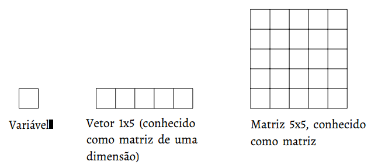

# 5. Variáveis

Antes de tudo devemos aprender que um **literal** é um valor fixo, "cru", de diversos tipos, como número inteiro, texto, números de ponto flutuante \(número com casas decimais\), booleanos \(verdadeiro e falso\) etc. Por exemplo: `10` é um literal do tipo número inteiro, `"arthur"` é um literal do tipo string\(texto, vetor \[espécie de lista\] de caracteres\) e assim por diante.

Imagine a situação, você vai a uma festa e quer anotar o número de telefone de algumas pessoas para entrar em contato em busca de emprego. Pensando nisso, você tem a ideia de levar 10 papéis, durante a festa você anota o número das pessoas nos papéis, de um lado do papel você colocou o número de telefone e do outro lado você coloca o nome da pessoa. Neste exemplo, você armazenou dados de pessoas em papéis e, para identificá-los, você usou o nome da pessoa. Este é um ótimo exemplo de uso de variáveis. A variável é o papel que pode receber um valor, caso você erre, basta apagar e escrever novamente. De um lado está o valor da variável e do outro está o seu identificador.

Assim, uma **variável** é uma região de memória para armazenar um valor \(como um literal\) que é identificada por um **identificador** \(nome\), sendo um nome simbólico para referenciar \(ou é associado a\) um valor que pode ser alterado ao longo do código. É como se fosse um papel onde você anota o número de telefone de alguém. Imagine a seguinte cena: você conhece o dono de uma empresa X, então pega um papel para anotar seu número de telefone, você pega o papel escreve com lápis de um lado dele Dono da Empresa X e do outro lado você anota o número de telefone dele. Nesta cena, o papel é a região de memória onde o telefone será escrito e `Dono da Empresa X` é o nome da variável que é o papel. Caso você o dono da empresa mude ou o número de telefone do dono se altere, você pode apagar o número anotado e colocar o novo número. Perceba que você define o nome da variável e o valor dela \(número de telefone\) pode ser alterado ao longo do tempo.

Em códigos será muito comum o uso de variáveis, pois você sempre precisará guardar informações para utilizar posteriormente. No caso do telefone do Dono da Empresa X, você poderia pegar esse número de dar a alguém ou apenas exibir ele para uma pessoa.

Para utilizar uma variável precisamos conhecer o **operador de atribuição**. Este operador varia de linguagem para linguagem, mas geralmente é um sinal de igual \(`=`\) e significa que o valor à direita será atribuído a variável à esquerda. Este é o comportamento mais comum, mas pode ter alterações. O código abaixo mostra uma variável de identificador `nome` recebendo o valor `"Arthur"`, sabemos que ela recebe tal valor, pois é utilizado o operador de atribuição.

```text
nome = "Arthur";
```

Os nomes de variáveis precisam ser bem descritivos, não tem problema ser muito **verboso** \(grande\), o importante é ter seu propósito bem nítido, por exemplo, veja os códigos abaixo e nos diga qual deles é mais fácil entender o propósito da variável.

```text
inteiro x = 29
```

```text
inteiro idade = 29
```

```text
inteiro idade_usuario = 29
```

Percebeu a diferença entre os identificadores \(nomes\) das variáveis acima? Portanto, de agora em diante, escolha bons identificadores para as suas variáveis. Além disso, o identificador de uma variável deve seguir algumas regras, cada linguagem tem as suas, contudo recomendo seguir as seguintes regras para criar identificadores de variáveis:

* iniciar com letra minúscula, nunca com número ou letra maiúscula;
* ter todas letras em maiúscula se e somente se for uma constante \(variável que não se altera, como uma variável para o número Pi\). Na próxima seção explico o conceito de constante;
* utilizar um padrão de identificador, ver capítulo [Boas práticas e Padrões de Código](boas-praticas-e-padroes-de-codigo.md); e
* ser bem descritivo, deve ser fácil entender o que tal variáveis irá armazenar apenas lendo o seu identificador.

Essas variáveis podem ser de diversos **tipos**, ou melhor, podem receber valores de diversos tipos. Note que é possível existir o tipo da variável e o tipo do valor da variável, mas cada linguagem funciona de uma forma, então não se preocupe por enquanto. Cada linguagem tem o seu conjunto de tipos disponíveis, abaixo apresento os mais comuns: 

* números inteiros;
* números em ponto-flutuante \(números reais, números com casas decimais\);
* caracteres;
* textos \(conjunto de caracteres\); e
* arrays, conhecidos como vetores e matrizes \(conjunto de variáveis\).

Os vetores e matrizes são conjuntos de variáveis. Na Figura 5.1 são ilustradas as regiões de memória para uma variável simples, um vetor \(matriz de uma dimensão\) e uma matriz. Perceba que um vetor e uma matriz são conjuntos de variáveis, podendo ser de qualquer tipo disponível \(há linguagens que permitem vários tipos diferentes em um vetor ou matriz\).



## Constantes

Constantes são regiões de memória que recebem um valor inicialmente, mas que não permitem a alteração, pois têm valores constantes. Em outras palavras, são "variáveis" que não podem ter alteração de valor ao longo do tempo, geralmente a própria linguagem acusa erro de sintaxe durante a compilação \(linguagem compilada\) ou interpretação \(linguagem interpretada\). Portanto, são nomes atribuídos a valores que não serão alterados, podendo ser utilizadas para definir valores de constantes matemáticas, como o número `pi`. Ressalto que há linguagens que têm palavras-chave específicas para indicar que uma variável é constante facilitando o uso. Abaixo ilustro um exemplo apenas para facilitar o entendimento, porém cada linguagem aborda o conceito de uma forma diferente.

```text
const pi = 3.1415 // Não acusa erro, pois o valor pode ser atribuído na declaração da variável
pi = 3.141592 // Acusa erro, pois a variável pi é constante.
```

## Tipos Primitivos

As variáveis e constantes podem ser de vários tipos ou receber valores de diversos tipos, como um número inteiro, um número em ponto flutuante \(números reais \(R\)\), vulgarmente números com vírgula, um texto, um valor booleano \(verdadeiro ou falso\) etc.

Esses tipos podem ser primitivos ou complexos, os tipos primitivos são, como o nome diz, primitivos, como um número inteiro. Já os tipos complexos são tipos que utilizam tipos primitivos, são tipos novos, como classes em uma linguagem orientada a objetos. Cada linguagem tem sua tabela de tipos pré-definidos.

## Tipos de Tipagem

Essa seção é bastante complicada e muito controvérsa, pois os conceitos não são muito bem definidos por ninguém, portanto não tente entender perfeitamente, leia apenas por alto. Alguns conceitos em programação costumam ser bastante confundidos, tudo relacionado a tipagem entra nessas confusões, então abaixo veja as definições mais aceitas.

As linguagens de programação podem ter **tipagem dinâmica** ou **estática** e serem **forte** ou **fracamente tipadas**, estes conceitos são importantes, pois cada um tem suas características, além disso é preciso saber o que é **inferência de tipo** abaixo cada conceito é explicado.

**Inferência de tipo** significa que a linguagem consegue definir o tipo de uma variável em tempo de execução ou compilação, por exemplo a linguagem Java em sua versão 9 propôs algo parecido com o que já existe no C\#, o "tipo" var. Abaixo segue um exemplo em Java 9:

```text
var name = "Arthur Assuncao"; // ao atribuir o valor, o compilador atribuirá o tipo String à variável
var number = 26; // ao atribuir o valor, o compilador atribuirá o tipo int/Integer à variável
```

### Tipagem Estática

A tipagem estática está relacionada a linguagem garantir que uma variável nunca alterará seu tipo, podendo alterar apenas seu valor, ou seja, uma variável de tipo inteiro não pode se tornar uma variável do tipo texto, por exemplo.

Em Portugol Studio podemos testar essa situação da seguinte forma:

```text
inteiro numero = 26 // a variável name é do tipo inteiro
numero = "Arthur" // Erro. Vai gerar um erro de compilação, pois a variável é do tipo inteiro
```

### Tipagem Dinâmica

Já a tipagem dinâmica é quando a linguagem permite que uma variável mude seu tipo em tempo de execução, realizando a inferência de tipo. Nesse tipo de linguagem, as variáveis não costumam ter tipos definidos na declaração das variáveis, assim uma variável pode assumir qualquer tipo dependendo do momento.

Em JavaScript podemos fazer o seguinte:

```text
var name = "Arthur Assuncao" //a variável name é do tipo string
name = 26 //a variável agora é do tipo number (número)
```

### Fracamente Tipada ou Tipagem Fraca

Tipagem fraca significa que o compilador/interpretador não verifica os tipos das variáveis nas operações em tempo de execução ou compilação, por exemplo, você pode somar um número com um texto e ele gerará algum resultado sem qualquer erro, gerando assim uma **coerção implícita**, ou seja, mudança no tipo do valor para que a operação execute sem erros.

Por exemplo, em JavaScript é possível fazer como no código abaixo, perceba que a linguagem converte o valor `1` para `'1'` e então **concatena** as strings, a string `'1'` com `'1'`, o mesmo acontece na segunda linha. Concatenação é a junção de strings \(textos\).

```text
'1' + 1 // o resultado será '11'
'1' + false // o resultado será '1false'
```

### Tipada ou Tipagem Forte

Tipagem forte significa que o compilador/interpretador verifica os tipos durante a execução ou compilação das operações. Caso os tipos não sejam compatíveis, um erro é gerado.

### Resumo de Tipagem

* Variável tem tipo definido então é tipagem estática;
* Variável não tem tipo definido então é tipagem dinâmica;
* Valor tem tipo definido e não sofre coerção implícita então é tipagem forte;
* Valor não tem tipo definido e sofre coerção implícita então é tipagem fraca;

## Escopo de Variável

Escopo de uma variável é o bloco de código que delimita a existência dessa variável, algumas linguagens têm todas suas variáveis com escopo global, ou seja, que existem de forma global em relação ao código, assim existindo em todo o código. Por padrão, vamos entender que o escopo de uma variável é o bloco de código onde ela foi criada e todos os sub-blocos deste.

O código abaixo mostra o escopo da variável `contador`, veja que ela não existe fora do bloco onde foi definida/declarada. Na linha 3 a variavel `contador` é declarada com o valor 1, na linha 5, tentamos imprimir o valor da variável na tela, porém gera um erro indicando que a variável `contador` não existe, pois ela só existe dentro do bloco do comando `if`.

```text
let idade = 25
if (idade > 18) {
  let contador = 1
}
console.log(contador) // error: Uncaught ReferenceError: contador is not defined
```

