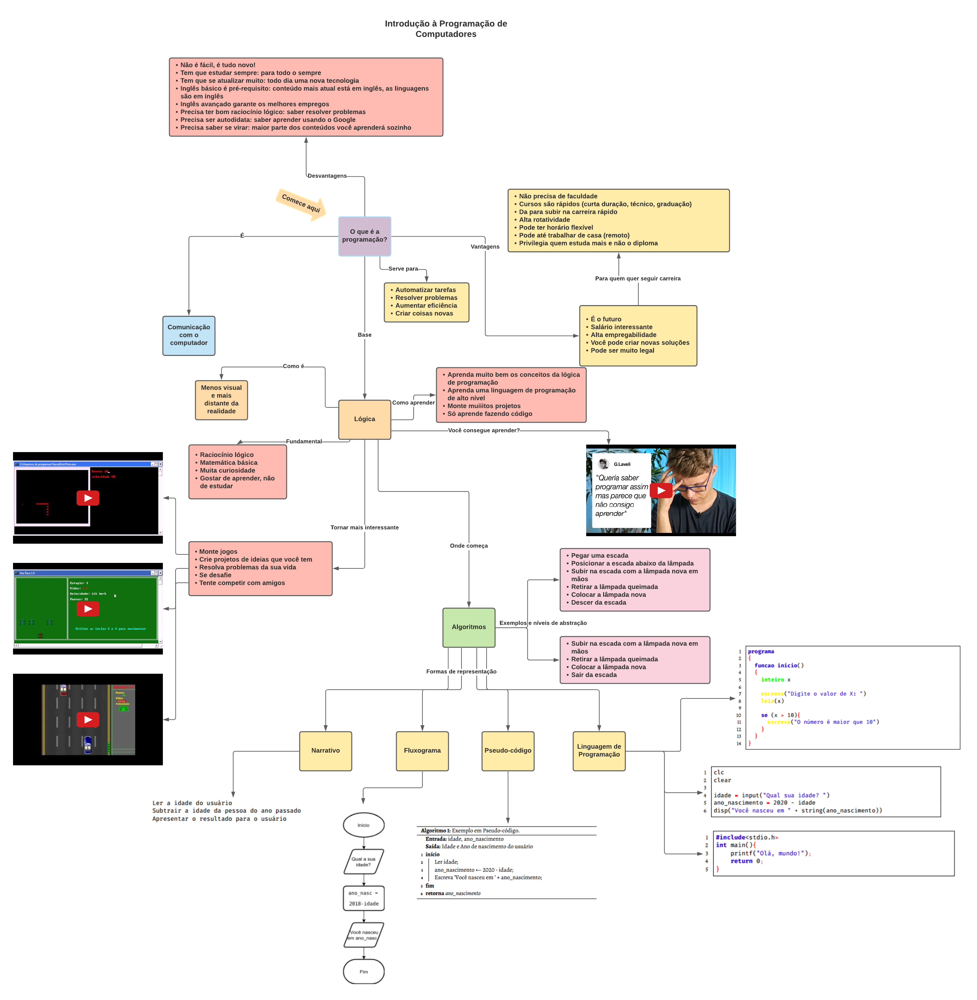

# 1. Por que Aprender a Programar

Seja bem-vindo, ao longo do livro irei te ensinar e te mostrar que programar é muito mais fácil do que tem sido ou do que seria se aprendesse com um professor tradicional. Se quiser ter uma visão geral assista ao vídeo [Introdução à Programação e Algoritmos](https://www.youtube.com/watch?v=5omj9Sm7cmA) onde explico o mapa conceitual da Figura 1.1.

## O que é a Programação ou Desenvolvimento de Software?

Se você está se familiarizando apenas agora com o termo, saiba que programação, de uma forma mais didática, é a arte de criar programas de computador utilizando uma linguagem de programação e estes programas são nada mais que conjuntos de instruções que indicam ao computador o que ele deve fazer, pense nas linguagens de programação como linguagens naturais como Português, Matemática, Libras e outras, contudo na programação você usa uma linguagem para se comunicar com os computadores.

> Programar é conversar com o computador, mais precisamente ordenar que ele realize ações.

Esta programação exige do aluno uma facilidade em relação ao pensamento lógico, por isso a primeira disciplina em cursos de tecnologia costuma ser a Lógica de Programação, pois nela se ensina o básico de programação e visa ajudar o aluno a desenvolver a sua lógica. E esta lógica de programação é a base para se programar computadores.

## Por que Aprender a Programar ou Desenvolver?

Esta é uma pergunta interessante, pois ajuda o aluno a entender que a programação é importante e não deve ser deixada de lado. Portanto, programar te ajuda a:

* Automatizar tarefas: Imagine que você faça diversas tarefas repetitivas no computador, você pode criar um programa para automatizar e te poupar tempo, além de evitar erros que nós humanos cometemos por falta de atenção.
* Resolver problemas: Pense nos programas e aplicativos, bem como nos sistemas eletrônicos que você utiliza e me diga, algum deles não resolve um problema? Todos resolvem e você pode criar novas soluções para você e para o mundo.
* Aumentar a eficiência: A programação permite pegar centenas de dados e realizar alguma tarefa sobre eles, por exemplo, verificar se todos alunos estão com suas datas de nascimento cadastradas demoraria muito tempo se fosse feito um por um e "na mão", mas um computador pode fazer em milésimos de segundo e com uma taxa de erros muito menor que um ser humano.
* Criar coisas novas: Com os itens acima ficou nítido que você pode criar novas soluções, mas destaco este item, pois é o mais fantástico, afinal um Desenvolvimento de Software é como um Deus no mundo dos computadores, a diferença para um Deus tradicional é que o Desenvolvedor de Software precisa estudar e trabalhar muito para desenvolver suas soluções, não somos onipotentes.

## Por que ser um Desenvolvedor de Software

Boa parte das profissões está desaparecendo e, assim, sendo substituídas por sistemas computadorizados, os profissionais que desenvolvem estes sistemas são os Desenvolvedores de Softwares, portanto estes serão os últimos profissionais a seres substituídos por máquinas, esta é a profissão do futuro.

Além disso, o salário não é ruim, claro que nem todos irão ganhar rios de dinheiro, mas há espaço para todos, é uma profissão que sempre tem emprego, é raro ver um Desenvolvedor de Software desempregado e um bom Desenvolvedor de Software \(espécie rara\) sempre consegue emprego.

Segundo o site Glassdoor o salário médio na cidade de [Juiz de Fora](https://www.glassdoor.com.br/Sal\%C3\%A1rios/juiz-de-fora-desenvolvedor-sal\%C3\%A1rio-SRCH_IL.0,12_IC2404436_KO13,26.htm) em Minas Gerais é de R$ 2.647, na capital de Minas Gerais, [Belo Horizonte](https://www.glassdoor.com.br/Sal\%C3\%A1rios/belo-horizonte-desenvolvedor-sal\%C3\%A1rio-SRCH_IL.0,14_IC2514646_KO15,28.htm), é R$ 3.252 e em [São Paulo](https://www.glassdoor.com.br/Sal\%C3\%A1rios/s\%C3\%A3o-paulo-desenvolvedor-sal\%C3\%A1rio-SRCH_IL.0,9_IM1009_KO10,23.htm) é de R$ 5.078. Todas as pesquisas foram realizadas no dia 12 de dezembro de 2019. Como pode ver o salário depende da localização, quanto mais perto das principais capitais, maior é a remuneração. Estes Desenvolvedores de Softwares são divididos em níveis e poderíamos classificá-los assim:

* Estagiário: Ainda estudante de curso técnico ou superior e pode ganhar entre R$ 500 e R$ 1.000, raramente ganhará mais na computação.
* Júnior: É quem acabou de se formar ou que tem um conhecimento básico, já sabe criar um sistema e tem bom conhecimento de alguma linguagem. Uma definição interessante é a do Filipe Deschamps, em seu vídeo intitulado 'O que um Sênior sabe, que um Pleno não sabe e um Júnior menos ainda', onde um Júnior é um profissional, formado ou não, que consegue usar as ferramentas \(como frameworks\) existentes e, assim, consegue montar um servidor, criar um site etc. Este costuma ter salários entre R$ 1.000 e R$ 3.000.
* Pleno: O pleno costuma ser o Desenvolvedor de Software com uns 2 anos de experiência e, para Deschamps, é um Desenvolvedor de Software que domina mais que apenas as ferramentas, mas entende mais o que se passa por "baixo dos panos", consegue até criar uma nova ferramenta. Pode ter uma remuneração de ganha de R$ 3.000 a R$ 6.000.
* Sênior: Este é expert e costuma ter mais de 5 anos de experiência, seu salário está acima dos R$ 6.000, podendo de forma não tão difícil chegar próximo aos R$ 10.000 em São Paulo. Para Filipe Deschamps e para o meu irmão, este profissional deve ter um conhecimento maior que apenas de uma situação específica, deve entender todo o contexto, saber o quanto suas ações de hoje irão refletir no sistema no futuro, como o quanto alguma solução irá escalar com o sistema completo com milhares de usuários.
* Especialista: Há empresas que usam esse termo para indicar o profissional que sabe tudo de sua área, está acima dos demais, pode ganhar pouco mais que o Sênior.

Perceba que são níveis de desenvolvedor, estes níveis vão variar de empresa para empresa, mas tentei apresentar um panorama geral, além disso um Desenvolvedor de Software pode se tornar um líder de time ou outro cargo mais gerencial e ter seu salário aumentado. O gráfico da Figura1 apresenta salários retirados do site Glassdoor, onde é possível ver que quanto mais próximo dos polos de tecnologia, maior é o salário e que, portanto, o salário varia muito de local para local e no interior é bem menor e que em São Paulo temos o melhor salário, contudo, sabemos também, o maior custo de vida.

Perceba, agora que, na Figura 2, segundo o mesmo site, no Canadá o salário chega a ser mais de 3x maior que no Brasil. Valores vazios significam que não foram encontrados e a busca foi feita com o termo em inglês e os valores em dólares canadenses foram convertidos para reais e divididos por 12, pois aparecem em valores anuais e não mensais. Estes salários são fornecidos por usuários cadastrados, portanto podem não refletir a completa realidade. Além disso, ressalto que a simpels conversão entre dolarés e reais não é a melhor, pois o ideal seria analisar o poder de compra em cada país e o quanto cada salário representa em relação ao poder de compra.

Além de tudo apresentado, é sabido que ser Desenvolvedor de Software ou desenvolvedor não exige nenhuma faculdade, algumas empresas até cobram isso, mas no geral exigem conhecimento e portfólio, como ter sistemas e códigos no Github. Porém, caso você queira um curso, pode fazer um curso superior de tecnologia, conhecido como tecnólogo, que tem uma duração menor que as graduações comuns, entre 2 e 3 anos, mas se esse tempo é muito para você ainda pode fazer cursos online de curta duração em plataformas como a Udemy e até assistir vídeos no Youtube.


Github é um repositório de códigos-fonte, Desenvolvedores costumam colocar os códigos de seus programas para portfólio e para que outros possam contribuir com os projetos


Esta área permite ainda uma rápida ascensão, pois você pode evoluir rápido no conhecimento e carreira, principalmente por causa da alta rotatividade, as vezes é como um leilão onde você vai para a empresa que lhe garanta mais coisas \(benefícios, salário, condições etc\), podendo ainda ter horário flexível \(ainda não são muitas empresas que permitem, mas nas grandes capitais é mais comum\) e, existe ainda, trabalho remoto, imagina trabalhar de dentro de casa com um bom salário? Não é essa flor toda que você imaginou, mas é possível. Mas nem tudo são flores, há empresas que pagam mal e a maioria exige um grande conhecimento em inglês. Além disso, a área se renova todo mês com grandes mudanças a cada semestre o que exige do profissional muita disciplina e vontade para aprender sempre mais, bem como ser muito autodidata e saber se virar, você não encontrará professores para tudo que precisa, principalmente se estiver estudando tecnologias de ponta.

Portanto, a profissão privilegia quem estuda mais e não quem apenas tem um papel para mostrar e, assim, é mais meritocrática e justa, diferente de diversas profissões que impedem que bons profissionais sem diploma atuem.

## Quais os passos para aprender a programar

Antes de tudo, você deve ter um bom nível ou estar disposto a melhorar os seguintes pontos: 

* Raciocínio lógico;
* Matemática básica;
* Inglês;
* Curiosidade; e
* Gosto por aprendizado.

Boa parte dos alunos até conseguem aprender os comandos e palavras-chaves das linguagens de programação, mas costumam ter problema em como aplicá-los, como usá-los na estrutura correta e, até, de como utilizá-los para resolver os problemas apresentados. Assim, recomendo que você: 

* aprenda bem os conceitos básicos de programação, como o que é um variável, quais comandos e operadores são usados para realizar comparações, como criar loops etc;
* aprenda a estrutura dos comandos, pois há uma ordem para utilizá-los; e, por fim,
* exercite muito, crie muitos códigos e resolva dezenas de exercícios, não precisa apenas fazer os que o professor lhe passar, utilize sites estilo Juiz Online que contém milhares de exercícios e também use o buscador Google.

	Para tornar o aprendizado mais interessante, sugiro tentar montar:

* jogos; 
* projetos que resolvam coisas da sua vida;
* projetos de ideias que você tem; e, até, 
* competir com amigos. 

Criar jogos é muito interessante, pois se torna desafiador e gera um programa legal, te dá orgulho. Por exemplo, uns amigos e eu fizemos uns jogos no início da nossa graduação, estes jogos podem ser encontrados no meu Github no repositório [HaxGames](https://github.com/ArthurAssuncao/HaxGames). Enquanto o primeiro Snake feito em Pascal foi feito, por mim, em uns dois a três dias, o último snake feito em linguagem C com a biblioteca Allegro foi feito em menos de 2h durante uma aula da disciplina de Linguagem de Programação, isso mostra o quanto evoluímos em relação à forma de pensar e elaborar soluções. No repositório do Livro no Github apresento códigos base interessantes para alguns casos, como jogo de snake, simples, em linguagem C.

Além dessas dicas, digo que você pode ser um Desenvolvedor de Software melhor se seguir algumas ideias, o site Little Blah criou uma lista com 60 dicas para desenvolvedores Sêniors em uma postagem chamada de [A Senior Engineer's CheckList](https://littleblah.com/post/2019-09-01-senior-engineer-checklist/). 	

Saiba que seguindo essas dicas você terá grandes chances de ser um bom Desenvolvedor de Software, pois boa parte, infelizmente, não é, mas não são por culpa das próprias atitudes conformistas e armadilhas de ego, pois temos:

* muitos Desenvolvedores viciados em formas ruins de programar, 
* desenvolvedores que acham que não precisam aprender nada novo,
* profissionais que vivem achando que as suas linguagens/frameworks/etc são os melhores do mundo, você ouvirá muitos dizendo que Java e C\# são os únicos que garantem segurança e _blablablabla_ e
* muitos que pensam que programar é só criar linhas de código que funcionam, estes esquecem que o código tem que ser bem escrito, documentado, deve seguir bons padrões de código \(patterns\) e, de preferência, terem testes automatizados para garantir, de fato, a eficiência e minimizar os erros.

Por fim, peço que siga alguns YouTubers ou contas no Medium para se informar mais sobre programação e para se motivar mais, um YouTuber muito famoso e motivador \(o cara exagera quando o assunto é ser carismático\) é o Filipe Deschamps, recomendo muito um vídeo em especial dele, o [NÃO CONSIGO APRENDER \(esse pensamento mudou a minha vida\)](https://www.youtube.com/watch?v=2F-4LdhrGuY). Onde ele mostra, de forma bem legal, por que você deve parar agora mesmo de pensar que nunca irá aprender qualquer coisa que seja.

### Como se motivar

Há diversas formas de se motivar, mas por mais que outras pessoas, como amigos e seus professores, digam e te motivem, o único jeito de você se sentir motivado e aprender cada vez mais é ver sentido no aprendizado, se você entender que precisa disso para alguma coisa, não apenas para um emprego, mas para algo maior, pois o emprego é um meio, ninguém quer trabalhar, a gente trabalha porque precisa para ter algo que realmente queremos ou gostamos de trabalhar porque sentimos prazer no resultado gerado, mas o trabalho no sentido de obrigação, ninguém quer. Então você precisa se conhecer e entender o que você quer, qual o seu sonho, sua meta de vida e por ai vai, ai sim verá na programação, no emprego de desenvolvedor, uma forma de alcançar seu sonho. Veja abaixo uma lista de perguntas que te ajudam a se conhecer melhor, mas já adianto, refletir sobre sua vida todos os dias é o melhor caminho, pare durante o banho, antes de dormir e pense, sonhe!

* Quais seus pontos fortes e fracos?
* Como você se vê daqui a 5 anos?
* Qual sua pretensão salarial para depois de aprender a programar?
* Quais são seus três pontos de melhoria principais como profissional, aluno ou pessoa?
* Como seus objetivos futuros se alinham com o conhecimento de programação?
* Quais são suas metas profissionais a longo prazo?
* O que mais motiva a mudar de vida?
* O quanto disciplinado você é com o seu tempo?
* No último ano, o que você tem feito para se capacitar \(estudo, cursos etc\)?
* Qual foi o último livro que você leu?
* Qual foi a última coisa que você ensinou a alguém?
* Como está o nível do seu inglês?

### Chega de Desculpas!!!

Aqui vai um insight de coach de coach quântico multiverso para mudar o seu mindset e ter sucesso. Pare de dar desculpas para tudo que não faz da forma correta, comecei com uma brincadeira, mas é sério. Você tem desculpas para começar a estudar, para parar de ver séries/animes, para comer de forma mais saudável, para fazer exercícios físicos regularmente e, até, para seus trabalhos escolares não feitos. 'Não comecei a estudar porque aconteceu tal coisa', 'Professor, não tive tempo de fazer porque tive um problema...', essas frases são clássica, mas me diga, você, em um emprego, diria isso a seu chefe? Ele aceitaria a desculpa? Então deixa disso e aceite a realidade, não deu porque teve adversidades, tranquilo, 'bola pra frente' e tente melhorar. Não pense que chegará um momento que você não terá problemas, você sempre terá algo para atrapalhar, é a vida, mas agora é hora de aprender a lidar e se abalar cada vez menos. Aprender a lidar significa colocar o problema no lugar dele, sem atrapalhar outras tarefas, sabe quando você era adolescente, ou até mesmo hoje em dia, e ficava mal por brigar com o namorado\(a\) e não conseguia fazer nada direito até resolver no dia seguinte? Com o tempo você aprende a lidar e deixa para resolver só no dia seguinte depois do seu trabalho e consegue trabalhar quase como se nada tivesse acontecido, isso é aprender a lidar, 'não da para resolver agora?' então deixe para pensar nisso no momento que der para resolver, ficar pensando o tempo todo no problema apenas atrapalha outras atividades da sua vida, então aprenda a lidar. O seu professor, chefe, amigo também passa por problemas, menores ou maiores, e muitas vezes você nem fica sabendo porque eles sabem separar e deixar cada coisa em seu devido lugar e momento, é como a lista de tarefas que você monta todo dia, você não pensa em fazer a tarefa de português na hora da tarefa de matemática, se pensa, você sabe que está errado e tenta não pensar, é isso.

> Não queremos fazer tudo que devemos, mas precisamos fazer do mesmo jeito.

Além disso, você pode dizer que costuma esquecer realmente de fazer algumas tarefas da sua vida, se essa é sua realidade, comece agora a utilizar alguma forma de anotação, alguns gostam de ter uma agenda em papel e outros, como eu, agenda no celular. É simples, na hora que receber alguma atividade ou marcar um evento, anote na agenda que você não irá esquecer. Nosso cérebro a cada dia fica mais esquecido, é muita coisa para fazer, então o único jeito é anotar o que tem que fazer, gosto também de utilizar ferramentas como o To Do para anotar as tarefas que preciso fazer para o dia e para a semana e vou marcando o que fiz, assim parei de esquecer.

Lembre, hoje uma tarefa mal feita ou esquecida, uma atividade não realizada não causa grandes prejuízos, mas no futuro pode causar prejuízos financeiros a empresa que você trabalha e, até, a morte de alguém, você deve ter acompanhado os acidentes com barragens no Brasil, não sabemos ao certo a real causa ou culpa, mas imagina se for por um erro de um engenheiro que fez algo errado porque tinha problemas? É justificável? NÃO!

Há ainda outras desculpas, eu não consigo aprender porque o professor é ruim, porque estou sem tempo, porque o material é ruim, porque tá chovendo, sei lá mais o que, mas pare com isso, realmente seu professor pode não ser o melhor, você pode ter mil coisas para fazer, mas vai ficar reclamando e aceitando o fardo de não aprender? Essa é a sua desculpa para se conformar e ficar deitado na sala vendo TV? Então pare e tente resolver o problema, se o professor não é bom, use o Google, pegue livros na biblioteca, faça cursos online, não sei, se vira, ficar sem aprender não deve ser opção e se conformar com qualquer que seja a situação é besteira. 

Outra coisa, pare de pensar que não consegue aprender, todo mundo consegue, o que varia é o tempo, uns aprendem mais rápido e outros mais devagar, uns aprendem melhor lendo e outros ouvindo, tudo varia, mas todos conseguem.

Porém, se você não está aprendendo porque não gosta do curso, da disciplina, então apenas aceite que precisa e estude o suficiente para passar, seja honesto consigo mesmo ou desista do curso. 'Arthur, mas desistir?' Desistir significa parar o que não é bom para você e pensar em fazer uma coisa que gosta, o conselho que sempre dou é: 'Estude algo que gosta e que lhe dará um retorno financeiro no futuro', afinal se você não gosta, será difícil estudar e se frustrará. Do contrário, se você gosta, mas não trará retorno financeiro, de nada ajuda, os boletos irão aparecer, as contas aparecem porque dinheiro é necessário e você se frustrará também. Então recomendo procurar um meio termo, algo que, no mínimo, você gosta um pouco e que renda, no mínimo, um retorno financeiro aceitável. A única hipótese diferente das que apresentei, é a de aprender a gostar de algo que trará retorno, é possível, você aprender a gostar de algo porque sabe que vai te dar um alto retorno no futuro, mas tome cuidado com essa ideia. 

### Seu professor erra porque, com o tempo, detalhes parecem irrelevantes

Depois de um tempo que você aprendeu algum conteúdo, muitos detalhes passam a ser abstraídos inconscientemente, por exemplo, se você for falar com alguém sobre uma fórmula que envolva a soma de elementos, você não irá explicar o que é e como se faz uma soma, porque você inconscientemente entende que a pessoa já saiba fazer uma soma ou que seja algo que ela intuitivamente irá conseguir fazer. Porém, esse evento acontece com todo tipo de conteúdo, inclusive com a programação, onde o professor sem querer ignora partes que para ele são óbvias ou apenas ignora porque de forma inconsciente não é necessário ensinar, como se os alunos já soubesse ou aprendessem de forma quase osmótica. Todos nós somos alunos e podemos ser professores, mesmo que momentaneamente, vou contar uma breve história. No início de 2020 comecei a fazer aulas de natação, a parte mais difícil do início é bater as pernas, ou como costumam falar pernada, os dois professores que me deram aula tentaram explicar, mas eu senti que faltava mais detalhes, então perguntei a um amigo que começou a aprender a cerca de 1 ano, ele ainda não abstrai os detalhes, este amigo me deu umas boas dicas. Assim, podemos dizer que os professores são ruins e meu amigo é um ótimo professor? Não, mas os professores mesmo muito bons abstraem certas questões de forma inconsciente, enquanto quem está aprendendo ou aprendeu recentemente ainda dá importância aos detalhes pois sabe que fazem diferença.

Por isso, peço que faça duas coisas: 1\) quando tiver dúvidas, tente pedir ajuda, também, a amigos que estão aprendendo ou que aprenderam recentemente, pois eles podem conseguir explicar o que o professor não conseguiu. 2\) caso consiga aprender sem o professor, tente avisar o professor sobre como aprendeu, pois ele poderá ajudar outros alunos. Os professores, em sua maioria, tem boa vontade e erram por falta de experiência ou outro motivo sem querer.

Chega desse papo de auto-ajuda, se você achou bobeira, tranquilo, se você achou útil, aproveite a ideia e vamos seguir com algo mais técnico nas próximas seções e capítulos.

### Melhore o seu Currículo

O primeiro passo é pensar que a ideia tradicional de currículo não tem grande efeito na computação, nesta área você é cobrado por Portfólio. Um portfólio é uma lista de projetos, você pode utilizar o Github para armazenar seus códigos, isso ajuda a empresa a saber o quão bom são seus códigos, e você, também, pode criar um site pessoal para armazenar imagens e links dos seus projetos. Mas e se você está começando e nunca trabalhou? Basta criar projetos pessoais ou mesmo recriar projetos existentes e deixar tudo disponível para que todos percebam a sua capacidade, imagina um Instagram criado por você?!! Os recrutadores poderiam ver o projeto e perceber que você consegue criar uma tela \(interface do programa/site\), um servidor e tudo mais.

Além de tudo isso, recomendo que faça cursos gratuitos ou pagos no YouTube e Udemy ou mesmo ler as documentações de novas tecnologias para sempre estar atualizado e, o mais importante, aprenda e melhore seu nível de fluência no idioma mundial, o inglês.

### Sites úteis para informações sobre emprego e salário

Aqui vai uma pequena lista de sites com vagas de empregos e salários para você conhecer melhor a área.

* [ProgramaThor](https://programathor.com.br)
* [Glassdoor](https://www.glassdoor.com.br)
* [AngelList](https://angel.co)
* [LinkedIn](https://linkedIn.com)
* [Trampos.co](http://trampos.co)
* [Vagas.com](https://vagas.com)
* [Salários no Stackoverflow](https://stackoverflow.com/jobs/salary)

