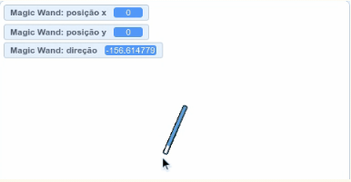

# 4. Introdução ao Scratch

## O que é Scratch

O Scratch é um software de programação em blocos voltado para o ensino de programação para crianças e está na versão 3.0. Esta programação em blocos se difere da programação tradicional por conter blocos pré-definidos de códigos em formato visual de bloco em vez da forma escrita. Foi desenvolvido pelo MIT e está disponível de forma online por meio do acesso ao [site do Scratch](https://scratch.mit.edu/) em um navegador de internet, como o Google Chrome ou Firefox, ou pelo download do programa, disponível para Windows, Mac, ChromeOS e Android. Uma antiga versão, a 1.4, era compatível com distribuições Linux, contudo seu suporte foi descontinuado.

### Por quê utilizar o Scratch

Porque é muito mais motivador utilizá-lo, os programas criados são animações ou jogos que são mais legais e, ainda, podemos utilizar o Scratch para:

* ensinar programação - muitos alunos têm dificuldade em aprender a programar, pois são conceitos novos que envolvem lógica, algo que considero pouco desenvolvido nos alunos;
* ensinar os conceitos: é possível ver os conceitos básicos da programação no Scratch e de forma fácil e rápida, além de visual; e
* motivar dos alunos: o scratch motiva os alunos, pois eles conseguem criar projetos incríveis e muito visuais.

### Onde podemos utilizar o Scratch

O melhor local para usar é no ensino, por ser uma ferramenta voltada à educação, e na criação de animações e jogos simples.

### Onde NÃO vamos utilizar o Scratch

Não iremos utilizar para programas de forma geral e jogos ou animações mais complexas e, claro, de forma comercial, pois o Scratch tem seu apelo didático apenas.

### Quais problemas o Scratch resolve

A dificuldade no ensino de programação, como o domínio das palavras reservadas, a estrutura do código, a forma abstrata de se pensar, dentre outras.

Visando o aprendizado de forma mais fácil e motivador, podemos iniciar o ensino da programação com o Scratch, que é desenvolvido pelo MIT e que consiste em um sistema para programação em blocos. A linguagem em blocos é muito mais simples que a linguagem tradicional, textual com sentenças. É como brincar de Lego, e, assim, é fácil, intuitiva e motivadora.

No Scratch, temos diversos conceitos de lógica de programação, como variáveis, comandos de entrada e saída, desvio condicional, estruturas de repetição e mais. A partir disso, podemos dizer que o Scratch é uma ferramenta completa para o ensino dessas disciplinas introdutórias a programação.

Ainda, temos o Scratch como uma ferramenta que permite a criação de animações e jogos de forma simples e com visual bastante bonito, dependendo apenas da criatividade e dons com softwares de edição de imagens.

Em resumo, o Scratch permite o ensino de forma simples e motivador, algo que as linguagens não costumam permitir. Contudo é importante lembrar que ele pode ser usado nas primeiras aulas, umas 8 aulas são mais que suficiente e depois pode-se iniciar o ensino das linguagens tradicionais, seja Portugol, Python ou C, por exemplo, esta última apenas se for realmente necessário neste momento, devido a sua dificuldade.

Pensando nisso, no ano de 2019, ao iniciar a primeira turma do curso Técnico em Automação, começamos a disciplina de programação com uma aula motivando os alunos sobre a área de programação, a explicação de algoritmos e depois o ensino do Scratch. Essas aulas de Scratch podem ser encontradas no seguinte endereço [Introdução ao Scratch](https://scratch.arthurassuncao.com/). Essas aulas foram feitas com o RevealJS com CSS que criei para ficar responsivo. O ensino de lógica costuma ser com os seguintes conteúdos na ordem que estão:

* Variáveis;
* Entrada e Saída de dados;
* Operações aritméticas;
* Operadores lógicos;
* Operadores relacionais;
* Estrutura condicional;
* Estrutura de repetição;

E mais, no Scratch, temos tudo isso e vamos mostrar agora. Para iniciar com Scratch, é possível realizar o download ou usar a interface web. Vamos usar a versão Web e, para isso, acessar o site [Scratch.mit.edu](http://scratch.mit.edu/) e clicar em Comece a Criar. Isso nos leva a interface web do Scratch, como a Figura 4.1 apresenta. 

### Como Começar

Podemos começar de várias formas, nos slides do link acima, começo apresentando o que o Scratch permite fazer e vou incrementando as funções ensinando cada comando a medida que é necessario, chamo isso de **aprendizado por demanda**. Considero ótima forma de se aprender uma linguagem ou tecnologia de forma rápida e mais interessante, pois remove o excesso de teoria e se aprende com base no que é necessário a cada momento, o ponto negativo é que não se aprende tudo, pois se limita ao que foi necessitado. Mas imagine, em vez de ler um livro ou fazer um curso de React \(tecnologia para desenvolvimento de sistemas web no front end\) você pode ler um código base e então comece a montar seu site e a cada necessidade você pesquise como fazer, assim você aprende e faz o que precisa, tudo por demanda e sem ter que esperar dias/mês para começar a montar algo de verdade. E num momento posterior você pode estudar mais a fundo seja com livro ou curso.

Antes da explicação, apresento alguns conceitos básicos da ferramenta:

* Sprite: são os objetos e personagens da animação e jogo;
* Stage: é o palco onde os sprites irão se movimentar;
* Cenário: É o plano de fundo do stage;
* Script: é o roteiro do jogo/animação ou, seja, o conjunto de blocos de comandos que dão vida à animação ou jogo. Cada sprite e cenário pode ter um Script;

Ainda na Figura 4.1, você pode observar cada uma das áreas de acordo com a legenda, esta legenda foi adicionada a imagem para facilitar seu entendimento. Nela temos:

* Área de Stage \(Palco\): é o palco onde ficarão os sprites;
* Área de Sprite \(Ator\): esta área é a Sprite List onde ficam exibidos os thumbnails \(miniaturas\) dos sprites incluidos no jogo/animação, esta área permite o acesso mais fácil a cada sprite;
* Área de Abas: esta área exibe as abas disponíveis;
* Área de Categorias: esta parte apresenta as categorias de blocos de comandos disponíveis;
* Área de Blocos de Comando: área que mostra os comandos da categoria escolhida;
* Área de Script \(Roteiro\): esta área mostram os blocos de comando sendo utilizados pelo sprite ou cenário atual;

O stage tem um tamanho pré-definido e utiliza o sistema de coordenadas cartesianas \(x, y\) e tem 480 pontos no eixo X e 360 pontos no eixo Y, sendo metade desses valores para cada sentido em cada eixo, como ilustra a Figura 4.2.

Além disso, é permitida a rotação de um personagem no stage, esta rotação utiliza os ângulos de uma circunferência, como a Figura 4.3 apresenta.

Esta plataforma, tem diversas categorias com comandos e blocos que podem ser utilizados, cada categoria representa um tipo diferente de conjunto de blocos onde os comandos em azul são referentes à Movimento, os roxos são referentes à Aparência, magenta à Som, amarelo à Eventos, laranja à Controle, ciano à Sensores, verde à Operadores, laranja escuro à Variáveis e ainda é possível criar os seus próprios blocos que ficam em um tom de vermelho. Essas categorias podem ser vistos na Figura 4.4.

## Exercícios

Antes de aprendermos conceitos sobre programação, vamos fazer exercícios no Scratch. A finalidade será mostrar que é fácil usar o Scratch. Ainda não começamos a aplicar nossa metodologia. Quero apenas mostrar para você que é legal e interessante usar o Scratch, ou seja, quero te motivar.

### Exercício Prático: Primeiros Movimentos no Scratch

**Exercício 1**

Arraste o sprite Gato pela área do stage \(palco\) e observe a posição X e Y indicada no campo X e Y.

**Exercício 2**

* Vamos fazer o Gato \(sprite\) se movimentar na tela \(palco ou stage\);
* Na categoria Movimento: arraste o botão 'Mova &lt;10&gt; passos' para a área de comandos \(scripts\);
* Mantenha o valor 10 no comando Mova;
* Teste clicando duas vezes sobre o comando;
* Teste com outros valores no comando Mova;

**Exercício 3**

* Vá no projeto [Esconde-Esconde](http://scratch.mit.edu/projects/24155933);
* Selecione "Ver interior";
* Analise o código e o jogo, focando nas coordenadas;

**Exercício 4**

* Abra um Novo arquivo e, na categoria Movimento, adicione ao roteiro o comando 'mova &lt;10&gt; passos' com o valor 100;
* Na categoria Eventos, adicione o comando 'quando &lt;bandeira-verde&gt; for clicado' acima do primeiro comando e clique na bandeira verde para testar;
* Na categoria Aparência, adicione o comando 'diga &lt;Olá&gt; por &lt;2&gt; segundos' ao roteiro;
* Na categoria Movimento, use o comando 'aponte para a direção &lt;90&gt;' com o valor -90;
* Para corrigir o problema do ator ficar de cabeça para baixo, use o comando 'defina o estilo de rotação para &lt;esquerda-direita&gt;';
* Use mais um comando 'mova &lt;10&gt; passos';
* Coloque mais uma fala, agora com a mensagem "Voltei!";
* Em Movimento, coloque o comando 'aponte para a direção &lt;90&gt;';
* Adicione o comando 'Sempre' em volta dos comandos para que fique em \textit{loop} infinito;

Abaixo, na Figura 4.5 apresento a solução do exercício 4.

**Exercício 5**

* Quando criamos um novo projeto o único ator \(sprite\) é o do Gato, mas podemos usar outro;
* Escolha um novo ator, use o Anina Hip-Hop;
* Delete o Gato da lista de atores;
* Faça uma animação com o ator usando o comando 'próxima fantasia';
* Coloque um comando 'espere &lt;0.5&gt; seg' para que as fantasias não mudem muito rápido;

Abaixo, na Figura 4.6 apresento a solução do exercício 5.

### Interação com o Usuário

É possível ter um programa com interação com o usuário, algo fundamental em um jogo. Para ensinar estas interações, usarei exemplos práticos.

#### Bola seguindo o Mouse

Faça a bola seguir o cursor do mouse infinitamente, para isso inclua um sprite de bola e use o comando 'vá para &lt;ponteiro do mouse&gt;'.

#### Mirando com o Mouse

Vamos criar um bastão que irá seguir parcialmente o mouse a ponto de ser utilizado como mira, ficará como na Figura 4.7. Faça o seguinte:

* Mude o ator para o Magic Ward;
* Vá na aba Fantasias e apague os raios amarelos;
* Use o comando 'aponte para &lt;ponteiro do mouse&gt;' para que ele aponte para o mouse sempre;
* Use o comando 'sempre' para que sempre aponte;
* Na categoria Movimento, marque os botões Posição x, Posição Y e Direção;

#### Colisão de um bola com a borda

Vamos fazer um bola seguir em uma direção e ao colidir com a borda do stage voltar na direção oposta. Para isso:

* inclua um sprite de bola e;
* adicione o comando 'se tocar na borda, volte'.

**Colisão de um bola com um sprite**

A partir do código anterior, vamos colocar mais um sprite no stage e, quando a bola tocar nele, ela irá voltar na direção oposta. Assim, adicione um outro sprite na tela, como ilustra a Figura 4.8. Após isso, adicione o comando `se <> então` e dentro do espaço do `se <> então` coloque o comando `tocando em <NomeOutroSprite>`, onde o NomeOutroSprite deve ser o nome do sprite que você adicionou recentemente.

**Exercício Prático: Criando o primeiro jogo em Scratch**

Crie um jogo de colher maça, como na Figura 4.9. Para isso:

* Crie o jogo da colheita de maça;
* Use um sprite como o Bowl e a maça, Apple;
* Faça a maça cair aleatóriamente sempre começando do topo, variando apenas o eixo X;
* Faça a tigela \(Bowl\) movimentar junto com o mouse, variando apenas o eixo X;
* **Desafio**: Adicione pontuação.

Até aqui você utilizou diversos recursos de programação sem saber exatamente seus conceitos, isso é incrível, pois mostra o quanto o Scratch é intuitivo, então, agora vou lhe ensinar todos os conceitos que servirão de base para o aprendizado de qualquer uma das linguagens nas próximas seções. 

